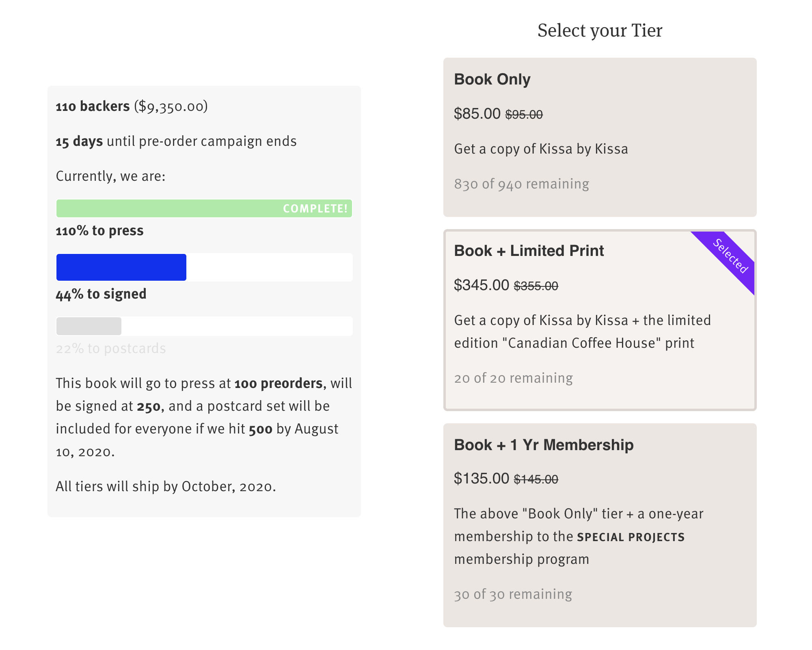

# Craigstarter

An indie kickstarter-like experience for Shopify with multiple goals and variants as tiers. 

## Installing

Note: The included `product-template.liquid` file is based off the "Simple" theme. You'll have to modify it if you're using something else. 

I've tried to make this as simple as possible to install / setup without it being a plugin. 

Place `camapign.liquid` into your template `snippets` folder. 

Place `campaign.scss` into your template `assets` folder.

Add `{{ 'campaign.scss.css' | asset_url | stylesheet_tag }}` between the `<head> </head>` tags in `theme.liquid`.

Either backup your `product-template.liquid` file and replace with the included `sections/product-template.liquid` or copy over the relevant `campaign`-related sections to your own template. 

The campaign sidebar is rendered using the following line: 
``

### Variables / Metafields
All variables used by the Craigstarter snippet to run a campaign are set using product / variant metafields. 

#### For products

`fundingcampaign:` TRUE = running campaign 

`campaignenddate:` when the campaign ends in format of : 
  YEAR-MO-DA HR:MN, i.e., 2020-08-15 22:30

`totalavailableproducts:` how many total products you're selling (all variants inclusive)

`goalamounts:` defines # of goals and sales amount per goal in comma-separated format: 
 NUM, NUM, NUM, i.e., 100, 250, 500

`goaltext:` the text appearing with each goal, for each goal amount in comma-separated format: 
 TEXT, TEXT, TEXT, i.d., to print, to signed, to postcards

`campaigninfo:` text blob appearing below goals, can contain html, et cetera

#### For variants

`variantdescription:` The extended description appearing in the selection box
`totalquantity:` Total number of available items for this variant; 
  sales calculated based on totalquanity - remaining inventory 

----

Metafields can be easily edited without a plugin using the following url structure: 

#### For products: 

`https://YOURSHOP.myshopify.com/admin/bulk?resource_name=Product&edit=metafields.global.fundingcampaign,metafields.global.campaignenddate,metafields.global.totalavailableproducts,metafields.global.goalamounts,metafields.global.goaltext,metafields.global.campaigninfo`

#### For variants: 

`https://YOURSHOP.myshopify.com/admin/bulk?resource_name=ProductVariant&edit=metafields.global.variantdescription,metafields.global.totalquantity
`